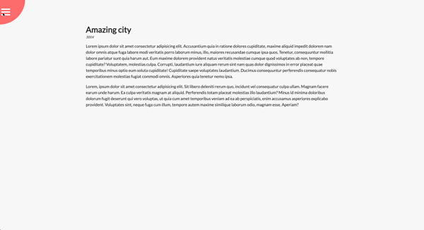

<div align="center" >
  
</div>

## Rotating View example

This small projects is a quick reference to show a rotating view example. Css courtesy of [Brad Traversy](https://github.com/bradtraversy).

## Getting Started

First of all, make sure you&#39;ve installed [Node](https://nodejs.org).

Then install dependencies:

```bash
$ yarn
```

## Workflow

Start a local development server:

```bash
$ yarn start
```

Access invoicing under `http://localhost:3000/`

Format code:

```bash
$ yarn format
```

Lint code:

```bash
$ yarn lint
```

Commit changes:

```bash
$ yarn commmit
```
